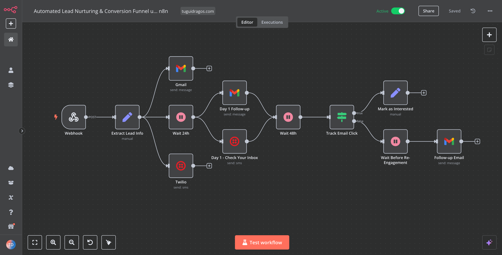
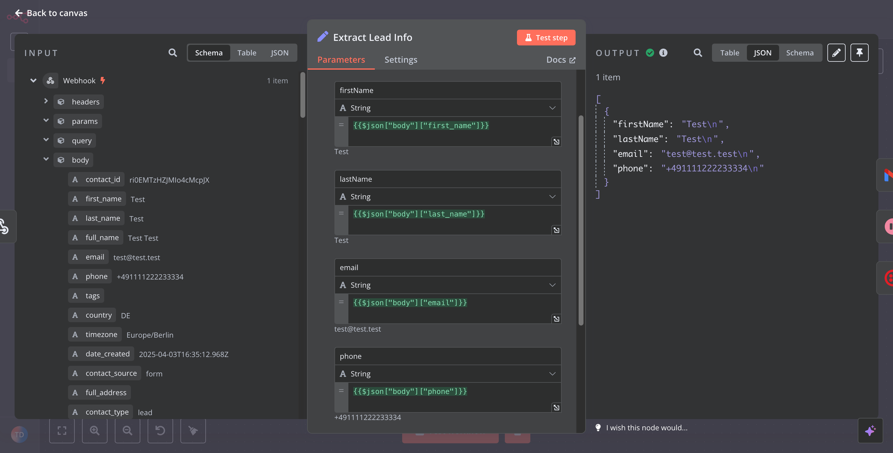
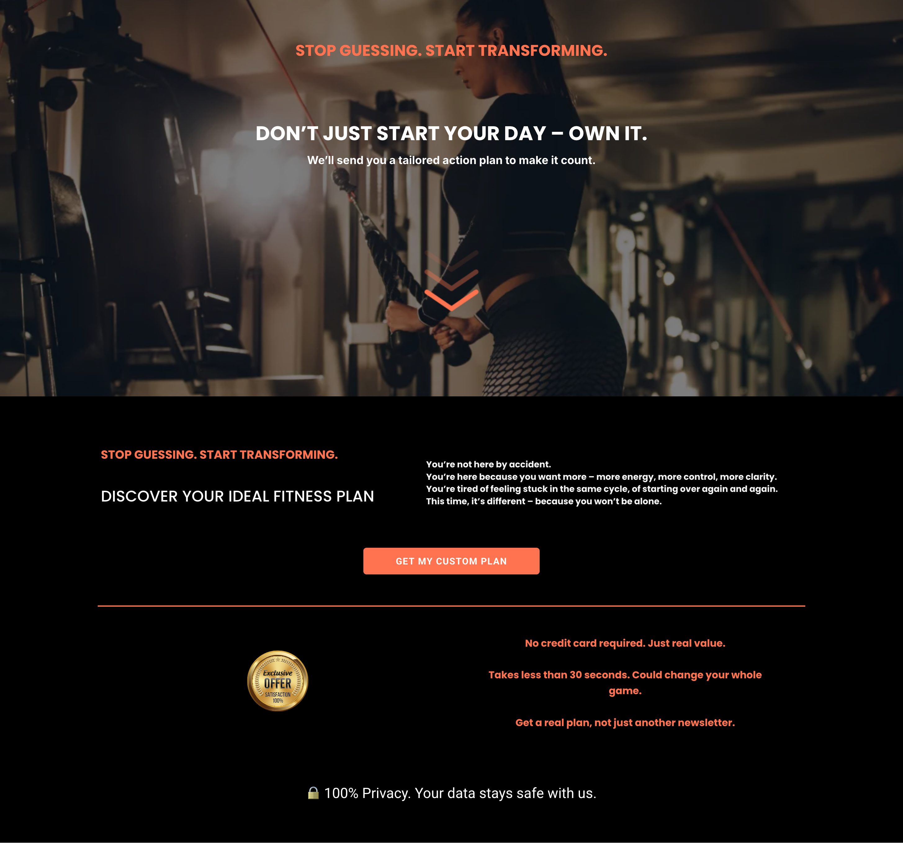
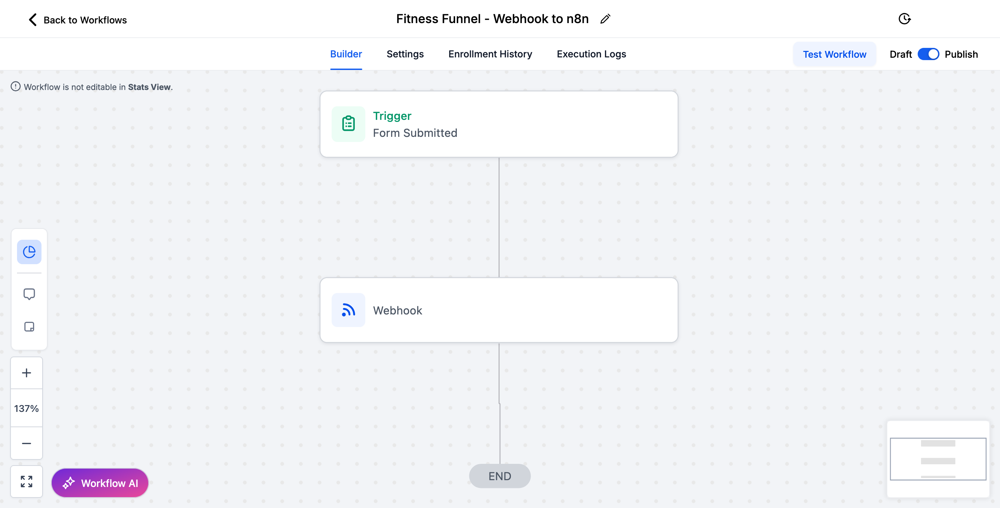

## Automated Lead Nurturing & Conversion Funnel using GoHighLevel + n8n

This is a modular, scalable automation system designed to turn cold leads into warm clients — fully automated. Whether you're in **fitness, coaching, real estate, ecommerce, or digital services**, this funnel adapts to your niche, your style, your business.

It captures leads via a form, sends personalized emails and SMS, tracks engagement, and follows up based on behavior.  
**No-code. High-impact. Built to convert.**

---
 What This System Does

✅ Captures leads via funnel form (GoHighLevel)  
✅ Sends instant **welcome email + SMS**  
✅ Waits smart (24h, 48h) before triggering follow-ups  
✅ Tracks email link clicks (interested vs not engaged)  
✅ Tags and qualifies leads based on behavior  
✅ Re-engages cold leads automatically  
✅ 100% modular – can be adapted to any business

---

Ideal For:

- Coaches (Fitness, Life, Biz, Financial)
- Service Providers (Agencies, Freelancers, SaaS)
- Local Businesses (Clinics, Salons, Law Firms)
- Real Estate, Consultants, Ecommerce & More

---

Tech Stack

- [GoHighLevel](https://www.gohighlevel.com/) – for funnel, CRM & email
- [n8n](https://n8n.io) – for no-code backend automation
- Gmail API – for personalized emails
- Twilio – for SMS follow-up & confirmations

---

 Workflow Overview

1. Lead submits form** (via GoHighLevel)
2. Webhook triggers n8n**
3. Lead info is parsed**
4. Email & SMS are sent instantly**
5. Wait 24h → Email & SMS follow-up**
6. Wait 48h → Check engagement (clicked email?)**
7. If interested → tag lead  
8. If cold → send re-engagement email  
9. Done. You’ve built a smarter funnel.

---

Screenshots

1. Full Workflow Overview (n8n)

### 2. Webhook Input & Lead Data Extract

### 3. Sample Funnel Page (Customizable Design)

### 4. GHL → Webhook → n8n Integration

---

 Live Demo

 Watch the full automation in action:  
 [Click to watch the full video on Vimeo](https://vimeo.com/1072318821)

---
 How To Customize This Automation System

This modular automation system was built to be **adaptable across industries** – from **fitness coaching** to **lead generation for digital agencies**, **CRM follow-up workflows**, and even **automated appointment reminders**.

You can plug it into your existing tools and flows without writing a single line of code.  
Perfect for **B2B lead nurturing**, **client onboarding**, or **email & SMS sales funnels**.

---
Components You Can Customize:

| Component                  | How to Customize                                         |
|---------------------------|----------------------------------------------------------|
| **Landing Page**          | Replace content, branding, colors, and CTA              |
| **Form Fields**           | Add/remove questions (e.g. budget, service type, location) |
| **Webhook Destination**   | Connect to any tool that supports webhooks (e.g. Zapier, Make, n8n) |
| **Message Content**       | Edit emails/SMS to match your voice & offer             |
| **Delays & Logic**        | Adjust follow-up timing, re-engagement rules, triggers  |
| **Lead Filters**          | Use tags, answers or behavior to qualify leads          |

---

 Example Use Cases (SEO Boosted):

- Coaches & Educators** – deliver personalized onboarding sequences for course clients  
- Beauty Salons / Clinics** – send automated appointment confirmation & SMS reminders  
- eCommerce & Shopify** – set up cart recovery flows and customer retention automations  
- Freelancers & Agencies** – automate proposals, follow-ups, and sales call bookings  
- SaaS & Digital Products** – deliver access links, tutorials, and upsell offers  

> If your business captures leads — this system turns them into paying clients.**

